# 📋 Resumen General - Generador de Muestras Aleatorias VBA

## 🎯 ¿Qué problema resuelve este código?

Imagina que tienes una **lista de 45 productos en inventario** y necesitas seleccionar **10 productos aleatorios** para una auditoría. ¿Cómo lo harías manualmente?

### 🚫 Método Manual (Problemático):
```
1. Escribir números del 1-45 en papelitos
2. Ponerlos en una bolsa
3. Sacar 10 papelitos uno por uno
4. Buscar manualmente cada producto en Excel
5. Copiar y pegar los datos...
```
**Tiempo estimado**: 15-30 minutos ⏱️

### ✅ Método Automatizado (Este Código):
```
1. Ejecutar macro ALEATORIO()
2. Escribir "10" en el InputBox
3. ¡Presionar Enter!
```
**Tiempo estimado**: 5 segundos ⚡

---

## 🧠 Concepto Fundamental: Muestreo Aleatorio

### ¿Qué es el muestreo aleatorio?
Es una técnica estadística donde cada elemento de una población tiene la **misma probabilidad** de ser seleccionado.

### 🎲 Analogía del Dado
```
┌─────────────────────────────────────┐
│  Población = Cara del dado (1-6)    │
│  Muestra = Tirar el dado 3 veces    │
│  Sin repetición = No sale 2 veces   │
│  el mismo número                    │
└─────────────────────────────────────┘
```

---

## 🏗️ Arquitectura del Sistema

### 📊 Estructura de Datos
```
📁 Libro de Excel
├── 📋 Hoja "Población inventario"
│   └── 📍 Rango A3:A47 (45 elementos)
│       ├── A3: "Producto ABC-001"
│       ├── A4: "Producto DEF-002"
│       └── ... (hasta A47)
│
└── 📋 Hoja Activa (Resultado)
    └── 📍 Rango A7:B450 (área de salida)
        ├── Columna A: Numeración (1,2,3...)
        └── Columna B: Productos seleccionados
```

### 🔄 Flujo del Proceso

```mermaid
graph TD
    A[🚀 Iniciar Macro] --> B[🧹 Limpiar datos anteriores]
    B --> C[❓ Solicitar cantidad]
    C --> D{✅ Cantidad válida?}
    D -->|No| E[❌ Mostrar error]
    D -->|Sí| F[📊 Cargar datos población]
    F --> G{📏 Suficientes datos?}
    G -->|No| H[❌ Error: pocos datos]
    G -->|Sí| I[🎲 Generar aleatorios]
    I --> J[📝 Escribir resultados]
    J --> K[🎯 Finalizar]
```


---

## 🎮 Ejemplo Interactivo

### Escenario: Auditoría de Inventario
Tienes estos productos en tu inventario:

| Fila | Producto |
|------|----------|
| A3   | Monitor Samsung 24" |
| A4   | Teclado Logitech MX |
| A5   | Mouse Razer DeathAdder |
| A6   | Webcam Logitech C920 |
| A7   | Auriculares Sony WH-1000XM4 |
| ...  | ... (hasta 45 productos) |

### 🎯 Objetivo: Seleccionar 3 productos aleatorios

#### Paso 1: Ejecutar la macro
```vba
' El usuario presiona Alt+F8 y ejecuta ALEATORIO()
```

#### Paso 2: Input del usuario
```
┌──────────────────────────────────────┐
│  Indique la cantidad de números      │
│  a generar:                          │
│  [ 3 ]                    [OK] [Cancel] │
└──────────────────────────────────────┘
```

#### Paso 3: Resultado automático
```
📊 Hoja Activa - Resultado:
┌─────┬─────────────────────────┐
│  A  │           B             │
├─────┼─────────────────────────┤
│  7  │  1  │ Webcam Logitech C920   │
│  8  │  2  │ Monitor Samsung 24"    │
│  9  │  3  │ Auriculares Sony WH... │
└─────┴─────┴─────────────────────────┘
```

### 🔬 ¿Por qué estos 3 productos?
- **Proceso aleatorio**: Cada producto tenía 1/45 probabilidad
- **Sin repetición**: Cada producto solo puede aparecer una vez
- **Reproducible**: Si cambias la semilla, obtienes otros resultados

---

## 💡 Casos de Uso Reales

### 🏥 Sector Salud
- **Selección de pacientes** para estudios clínicos
- **Auditoría de historiales** médicos aleatorios
- **Control de calidad** en laboratorios

### 🏭 Manufactura
- **Inspección de calidad** de productos
- **Selección de lotes** para pruebas
- **Auditoría de procesos** aleatorios

### 📊 Investigación
- **Encuestas poblacionales** 
- **Estudios de mercado**
- **Análisis estadísticos**

### 🎓 Educación
- **Selección aleatoria** de estudiantes
- **Muestreo de exámenes** para revisión
- **Evaluación de programas** educativos

---

## 🎨 Ventajas del Código

| Ventaja | Descripción | Impacto |
|---------|-------------|---------|
| ⚡ **Velocidad** | Proceso automático vs manual | 95% menos tiempo |
| 🎯 **Precisión** | Elimina errores humanos | 100% exactitud |
| 🔄 **Repetible** | Mismos parámetros = mismos tipos de resultados | Consistencia total |
| 📈 **Escalable** | Funciona con 5 o 500 elementos | Sin límites prácticos |
| 🛡️ **Robusto** | Maneja errores y validaciones | Uso profesional |

---

## 🧮 Matemática Detrás del Código

### Probabilidad de Selección
```
Para población de 45 elementos:
- Probabilidad de ser seleccionado = 1/45 ≈ 2.22%
- Para muestra de 10: probabilidad final = 10/45 ≈ 22.22%
```

### Algoritmo de Exclusión
```
El código usa un Dictionary para evitar repeticiones:
1. Genera número aleatorio entre 1-45
2. ¿Ya está en el Dictionary? 
   → Sí: Generar otro número
   → No: Agregar al Dictionary y continuar
```

---

**¡Continúa con [🔧 Variables y Configuración](02-variables-configuracion.md) para entender el código a detalle!**
