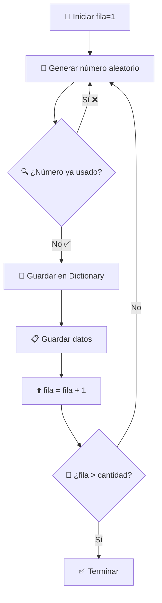

# 🎲 Algoritmo de Selección Aleatoria - El Corazón del Código

## 🧠 Concepto Central: Muestreo Sin Reemplazo

### 🎯 ¿Qué significa "Sin Reemplazo"?

**Analogía de la Urna** 🏺:
```
📦 Urna con 45 pelotas numeradas (1-45)
🎯 Queremos sacar 10 pelotas
❌ Sin reemplazo: No devolvemos la pelota a la urna
✅ Resultado: 10 pelotas únicas, sin repetir números
```

**VS. Muestreo Con Reemplazo** 🔄:
```
📦 Misma urna con 45 pelotas
🎯 Sacamos 1 pelota, anotamos el número
🔄 Devolvemos la pelota a la urna
❌ Problema: Podríamos sacar la misma pelota varias veces
```

---

## 🔧 Algoritmo Implementado: Dictionary-Based Exclusion

### 📋 Pseudocódigo del Algoritmo
```
INICIO
1. Crear Dictionary vacío (para tracking)
2. Inicializar contador = 1
3. MIENTRAS contador <= cantidad_solicitada:
   a. Generar número aleatorio entre 1-45
   b. ¿Número ya existe en Dictionary?
      → SÍ: Ignorar, generar otro número
      → NO: Agregar al Dictionary, guardar dato, incrementar contador
4. FIN
```

### 🎮 Implementación en VBA
```vba
' 🎯 PASO 1: Preparación
Set numerosUsados = CreateObject("Scripting.Dictionary")
Randomize ' Inicializar semilla aleatoria
fila = 1

' 🔄 PASO 2: Bucle principal
Do While fila <= cantidadSolicitada
    ' 🎲 PASO 3: Generar aleatorio
    numeroAleatorio = Int(Rnd() * totalDatos) + 1
    
    ' 🔍 PASO 4: Verificar duplicado
    If Not numerosUsados.Exists(numeroAleatorio) Then
        ' ✅ PASO 5: Agregar nuevo elemento
        numerosUsados.Add numeroAleatorio, True
        datosSeleccionados(fila, 1) = datosOriginales(numeroAleatorio, 1)
        fila = fila + 1
    End If
    ' ❌ Si ya existe, el bucle continúa sin incrementar fila
Loop
```

---

## 🎯 Análisis Paso a Paso con Ejemplo Real

### 📊 Escenario: Seleccionar 3 elementos de 10 disponibles

**Datos de Población**:
```
Índice  │  Valor
────────┼─────────────────
   1    │  "Producto A"
   2    │  "Producto B"  
   3    │  "Producto C"
   4    │  "Producto D"
   5    │  "Producto E"
   6    │  "Producto F"
   7    │  "Producto G"
   8    │  "Producto H"
   9    │  "Producto I"
  10    │  "Producto J"
```

### 🎲 Simulación de Ejecución

#### **Iteración 1**:
```vba
fila = 1, cantidadSolicitada = 3
numeroAleatorio = Int(Rnd() * 10) + 1
' Supongamos Rnd() = 0.67 → numeroAleatorio = 7

numerosUsados.Exists(7) = False  ✅
numerosUsados.Add(7, True)
datosSeleccionados(1, 1) = "Producto G"
fila = 2

Dictionary actual: {7: True}
```

#### **Iteración 2**:
```vba
fila = 2, cantidadSolicitada = 3  
numeroAleatorio = Int(Rnd() * 10) + 1
' Supongamos Rnd() = 0.23 → numeroAleatorio = 3

numerosUsados.Exists(3) = False  ✅
numerosUsados.Add(3, True)  
datosSeleccionados(2, 1) = "Producto C"
fila = 3

Dictionary actual: {7: True, 3: True}
```

#### **Iteración 3**:
```vba
fila = 3, cantidadSolicitada = 3
numeroAleatorio = Int(Rnd() * 10) + 1  
' Supongamos Rnd() = 0.65 → numeroAleatorio = 7

numerosUsados.Exists(7) = True  ❌
' No ejecuta el bloque If, fila sigue siendo 3
' El bucle continúa...

Dictionary actual: {7: True, 3: True}
```

#### **Iteración 4**:
```vba
fila = 3, cantidadSolicitada = 3
numeroAleatorio = Int(Rnd() * 10) + 1
' Supongamos Rnd() = 0.89 → numeroAleatorio = 9

numerosUsados.Exists(9) = False  ✅
numerosUsados.Add(9, True)
datosSeleccionados(3, 1) = "Producto I"  
fila = 4

Dictionary final: {7: True, 3: True, 9: True}
```

#### **Fin del Bucle**:
```vba
fila = 4, cantidadSolicitada = 3
4 <= 3 = False → Salir del bucle
```

### 📊 Resultado Final:
```
datosSeleccionados:
[1,1] = "Producto G"  (índice 7)
[2,1] = "Producto C"  (índice 3)  
[3,1] = "Producto I"  (índice 9)
```

---

## 🧮 Análisis Matemático del Algoritmo

### 📈 Probabilidad de Selección

**Para el primer elemento**:
- Probabilidad = 1/45 = 2.22%

**Para el segundo elemento**:
- Probabilidad = 1/44 = 2.27% (uno menos disponible)

**Para el n-ésimo elemento**:
- Probabilidad = 1/(45-n+1)

### ⏱️ Eficiencia Temporal

**Mejor caso**: O(n) - Todos los aleatorios son únicos
**Peor caso**: O(∞) - Infinitos duplicados (teóricamente imposible)
**Caso promedio**: O(n × k) donde k ≈ 1.1-1.5

### 📊 Análisis de Colisiones

**¿Cuántos intentos promedio necesitamos?**

Para población de 45 elementos:
- 1er elemento: 1 intento promedio
- 5to elemento: ~1.11 intentos promedio  
- 10mo elemento: ~1.29 intentos promedio
- 20vo elemento: ~1.80 intentos promedio

**Fórmula matemática**:
```
Intentos_promedio = N / (N - k + 1)
Donde N = población total, k = elemento k-ésimo
```

---

## 🎨 Visualización del Algoritmo

### 🗂️ Estado del Dictionary en cada paso

```
Objetivo: Seleccionar 5 elementos de población de 10

Inicio:     Dictionary = { }
Paso 1:     Dictionary = {3: True}
Paso 2:     Dictionary = {3: True, 8: True}  
Paso 3:     Dictionary = {3: True, 8: True, 1: True}
Paso 4a:    Genera 3 → Ya existe → No hace nada
Paso 4b:    Genera 7 → Dictionary = {3: True, 8: True, 1: True, 7: True}
Paso 5:     Dictionary = {3: True, 8: True, 1: True, 7: True, 9: True}

Resultado: [3, 8, 1, 7, 9] ✅
```

### 📊 Diagrama de Flujo Visual



---

## 🔬 Comparación con Otros Algoritmos

### 🆚 Algoritmo Alternativo: Fisher-Yates Shuffle

```vba
' Método Fisher-Yates (más eficiente)
For i = totalDatos To 2 Step -1
    j = Int(Rnd() * i) + 1
    ' Intercambiar elementos i y j
    temp = datosOriginales(i, 1)
    datosOriginales(i, 1) = datosOriginales(j, 1)  
    datosOriginales(j, 1) = temp
Next i
' Tomar los primeros N elementos
```

**Ventajas del Fisher-Yates**:
- ✅ Tiempo fijo: O(n)
- ✅ No hay colisiones
- ✅ Distribución perfectamente uniforme

**Desventajas**:
- ❌ Modifica el array original
- ❌ Más complejo de entender
- ❌ Requiere más memoria

### 📊 Comparación de Rendimiento

| Aspecto | Dictionary Method | Fisher-Yates |
|---------|-------------------|--------------|
| **Tiempo** | O(n×k) variable | O(n) fijo |
| **Memoria** | Dictionary extra | Sin memoria extra |
| **Simplicidad** | ⭐⭐⭐⭐ | ⭐⭐ |
| **Preserva datos** | ✅ | ❌ |

---

## 🛡️ Robustez del Algoritmo

### 🎯 Casos Edge Considerados

1. **Seleccionar 1 elemento**:
   ```vba
   ' Funciona perfectamente, sale en primera iteración
   ```

2. **Seleccionar todos los elementos (45/45)**:
   ```vba
   ' Eventualmente selecciona todos, pero ineficiente
   ' Últimos elementos toman muchos intentos
   ```

3. **Población pequeña**:
   ```vba
   ' Funciona con cualquier tamaño ≥ cantidad solicitada
   ```

### ⚠️ Limitaciones Actuales

1. **Ineficiencia con muestras grandes**:
   - Seleccionar 40 de 45 elementos es muy lento
   - Últimos elementos tienen alta probabilidad de colisión

2. **Sin control de tiempo máximo**:
   - Teóricamente podría ejecutarse indefinidamente
   - En la práctica, termina siempre

3. **Memoria del Dictionary**:
   - Crece linealmente con la muestra
   - No es problema para casos típicos

---

## 💡 Optimizaciones Posibles

### 🚀 Mejorar para Muestras Grandes

```vba
' Si muestra > 50% de población, mejor invertir la lógica:
If cantidadSolicitada > totalDatos / 2 Then
    ' Seleccionar elementos a EXCLUIR en lugar de incluir
    cantidadExcluir = totalDatos - cantidadSolicitada
    ' Aplicar algoritmo para excluir
    ' Tomar el resto como resultado
End If
```

### ⏱️ Agregar Timeout de Seguridad

```vba
Dim intentos As Long
Const MAX_INTENTOS As Long = 100000

Do While fila <= cantidadSolicitada And intentos < MAX_INTENTOS
    intentos = intentos + 1
    numeroAleatorio = Int(Rnd() * totalDatos) + 1
    ' ... resto del código
Loop

If intentos >= MAX_INTENTOS Then
    MsgBox "Error: Demasiados intentos. Verifique los parámetros."
End If
```

---

**¡Continúa con [📝 Flujo de Ejecución](04-flujo-ejecucion.md) para ver el proceso completo paso a paso!**
