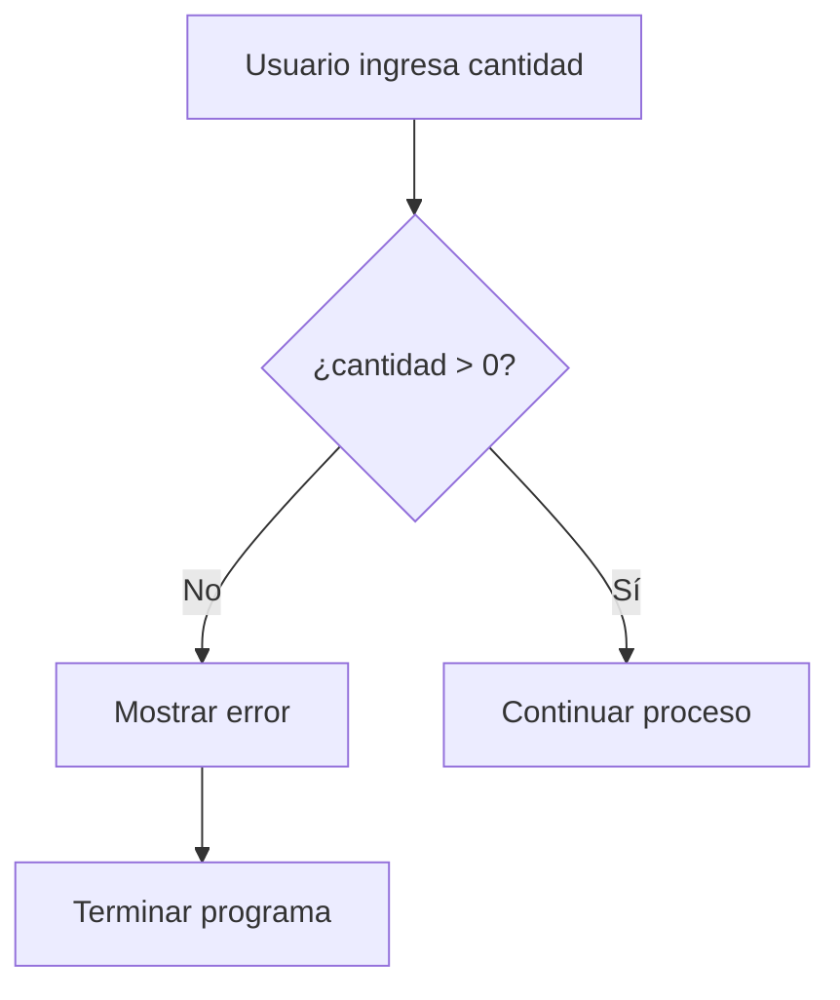

# 📝 Flujo de Ejecución - Proceso Completo Paso a Paso

## 🚀 Visión General del Flujo

### 🗺️ Mapa del Proceso
```
🏁 INICIO
  ↓
🧹 PREPARACIÓN  
  ↓
💬 ENTRADA DE USUARIO
  ↓  
🔍 VALIDACIONES
  ↓
📊 CARGA DE DATOS
  ↓
🎲 SELECCIÓN ALEATORIA
  ↓
📝 ESCRITURA DE RESULTADOS
  ↓
🧹 LIMPIEZA
  ↓
✅ FIN
```

---

## 📋 Fase 1: Preparación e Inicialización

### 🔧 Configuración Inicial
```vba
Sub ALEATORIO()
    ' 📍 Paso 1.1: Declarar variables locales
    Dim wsDestino As Worksheet
    Dim wsPoblacion As Worksheet
    Dim datosOriginales As Variant
    Dim datosSeleccionados() As Variant
    Dim numerosUsados As Object
    Dim i As Integer
    Dim fila As Integer
    Dim numeroAleatorio As Integer
    Dim cantidadSolicitada As Integer
    Dim totalDatos As Integer
```

### 🎯 Asignación de Referencias
```vba
    ' 📍 Paso 1.2: Establecer referencias de hojas
    Set wsDestino = ActiveSheet
    Set wsPoblacion = Worksheets("Población inventario")
    Set numerosUsados = CreateObject("Scripting.Dictionary")
```

**🔍 ¿Qué está pasando aquí?**

| Variable | Asignación | Propósito |
|----------|------------|-----------|
| `wsDestino` | Hoja actualmente visible | Donde se escribirán los resultados |
| `wsPoblacion` | Hoja específica llamada "Población inventario" | Fuente de datos |
| `numerosUsados` | Dictionary COM object | Tracking de números ya seleccionados |

### 🧹 Limpieza Preventiva
```vba
    ' 📍 Paso 1.3: Limpiar datos anteriores
    wsDestino.Range("A7:B450").ClearContents
```

**📊 Análisis del rango A7:B450**:
- **A7**: Fila inicial de resultados
- **B450**: Máximo teórico de 444 elementos (450-6)
- **¿Por qué hasta 450?** Rango generoso para cualquier caso de uso

---

## 💬 Fase 2: Interacción con el Usuario

### 🎯 Solicitud de Entrada
```vba
    ' 📍 Paso 2.1: Obtener cantidad solicitada
    cantidadSolicitada = InputBox("Indique la cantidad de números a generar")
```

### 🖥️ Comportamiento del InputBox

**InputBox en acción**:
```
┌─────────────────────────────────────────┐
│  Microsoft Excel                        │
├─────────────────────────────────────────┤
│  Indique la cantidad de números         │
│  a generar                              │
│                                         │
│  [    15    ]                           │
│                                         │
│  [   OK   ]    [  Cancel  ]             │
└─────────────────────────────────────────┘
```

**🎭 Casos de entrada posibles**:

| Entrada Usuario | Resultado cantidadSolicitada | Acción |
|------------------|------------------------------|--------|
| "15" | 15 | ✅ Continuar |
| "0" | 0 | ❌ Error |
| "-5" | -5 | ❌ Error |
| "abc" | 0 | ❌ Error |
| [Cancel] | 0 | ❌ Error |
| "" (vacío) | 0 | ❌ Error |

---

## 🔍 Fase 3: Validaciones

### ✅ Validación de Entrada Básica
```vba
    ' 📍 Paso 3.1: Verificar entrada válida
    If cantidadSolicitada <= 0 Then
        MsgBox "Por favor ingrese un número válido mayor que 0"
        Exit Sub
    End If
```

**🎯 Flujo de la validación**:


### 📊 Carga y Validación de Datos
```vba
    ' 📍 Paso 3.2: Obtener datos de población
    datosOriginales = wsPoblacion.Range("A3:A47").Value
    totalDatos = UBound(datosOriginales, 1)
```

**🔬 Análisis de `UBound(datosOriginales, 1)`**:
- `UBound`: Función que devuelve el índice superior del array
- `datosOriginales`: Array bidimensional
- `, 1`: Primera dimensión (filas)
- Resultado: 45 (elementos de A3 a A47)

### 🎯 Validación de Capacidad
```vba
    ' 📍 Paso 3.3: Verificar capacidad suficiente
    If cantidadSolicitada > totalDatos Then
        MsgBox "La cantidad solicitada (" & cantidadSolicitada & ") es mayor que los datos disponibles (" & totalDatos & ")"
        Exit Sub
    End If
```

**📈 Ejemplos de esta validación**:

| Cantidad Solicitada | Total Datos | Resultado |
|---------------------|-------------|-----------|
| 10 | 45 | ✅ Continuar |
| 45 | 45 | ✅ Continuar |
| 50 | 45 | ❌ Error |

---

## 🎲 Fase 4: Selección Aleatoria (El Corazón)

### 🔧 Preparación para Selección
```vba
    ' 📍 Paso 4.1: Preparar array de resultados
    ReDim datosSeleccionados(1 To cantidadSolicitada, 1 To 1)
    
    ' 📍 Paso 4.2: Inicializar generador aleatorio
    Randomize
    fila = 1
```

**🎯 Análisis de ReDim**:
```vba
' Para cantidadSolicitada = 5:
ReDim datosSeleccionados(1 To 5, 1 To 1)

' Resultado: Array con estructura:
' datosSeleccionados(1,1) = Primer elemento
' datosSeleccionados(2,1) = Segundo elemento  
' datosSeleccionados(3,1) = Tercer elemento
' datosSeleccionados(4,1) = Cuarto elemento
' datosSeleccionados(5,1) = Quinto elemento
```

### 🔄 Bucle Principal de Selección
```vba
    ' 📍 Paso 4.3: Bucle de selección sin repetición
    Do While fila <= cantidadSolicitada
        numeroAleatorio = Int(Rnd() * totalDatos) + 1
        
        If Not numerosUsados.Exists(numeroAleatorio) Then
            numerosUsados.Add numeroAleatorio, True
            datosSeleccionados(fila, 1) = datosOriginales(numeroAleatorio, 1)
            fila = fila + 1
        End If
    Loop
```

### 📊 Simulación Detallada del Bucle

**Escenario**: Seleccionar 3 elementos, totalDatos = 45

#### **Iteración 1**:
```
🎯 Estado inicial:
   fila = 1, cantidadSolicitada = 3
   numerosUsados = { } (vacío)
   datosSeleccionados = [?, ?, ?]

🎲 Generar aleatorio:
   Rnd() = 0.534 → numeroAleatorio = Int(0.534 * 45) + 1 = 25
   
🔍 Verificar duplicado:
   numerosUsados.Exists(25) = False ✅
   
📝 Guardar:
   numerosUsados.Add(25, True)
   datosSeleccionados(1,1) = datosOriginales(25,1) = "Producto XYZ"
   fila = 2

🎯 Estado final:
   numerosUsados = {25: True}
   datosSeleccionados = ["Producto XYZ", ?, ?]
```

#### **Iteración 2**:
```
🎯 Estado inicial:
   fila = 2, cantidadSolicitada = 3
   
🎲 Generar aleatorio:
   Rnd() = 0.123 → numeroAleatorio = Int(0.123 * 45) + 1 = 6
   
🔍 Verificar duplicado:
   numerosUsados.Exists(6) = False ✅
   
📝 Guardar:
   numerosUsados.Add(6, True)
   datosSeleccionados(2,1) = datosOriginales(6,1) = "Producto ABC"
   fila = 3

🎯 Estado final:
   numerosUsados = {25: True, 6: True}
   datosSeleccionados = ["Producto XYZ", "Producto ABC", ?]
```

#### **Iteración 3 (con colisión)**:
```
🎯 Estado inicial:
   fila = 3, cantidadSolicitada = 3
   
🎲 Generar aleatorio:
   Rnd() = 0.555 → numeroAleatorio = Int(0.555 * 45) + 1 = 25
   
🔍 Verificar duplicado:
   numerosUsados.Exists(25) = True ❌
   
🚫 No hacer nada:
   fila sigue siendo 3, bucle continúa

🎯 Estado: Sin cambios
   numerosUsados = {25: True, 6: True}
   datosSeleccionados = ["Producto XYZ", "Producto ABC", ?]
```

#### **Iteración 4 (exitosa)**:
```
🎯 Estado inicial:
   fila = 3, cantidadSolicitada = 3
   
🎲 Generar aleatorio:
   Rnd() = 0.889 → numeroAleatorio = Int(0.889 * 45) + 1 = 41
   
🔍 Verificar duplicado:
   numerosUsados.Exists(41) = False ✅
   
📝 Guardar:
   numerosUsados.Add(41, True)
   datosSeleccionados(3,1) = datosOriginales(41,1) = "Producto DEF"
   fila = 4

🎯 Estado final:
   numerosUsados = {25: True, 6: True, 41: True}
   datosSeleccionados = ["Producto XYZ", "Producto ABC", "Producto DEF"]
```

#### **Condición de Salida**:
```
🏁 Verificar condición:
   fila = 4, cantidadSolicitada = 3
   4 <= 3 = False → Salir del bucle
```

---

## 📝 Fase 5: Escritura de Resultados

### 🔧 Preparación de Rango de Salida
```vba
    ' 📍 Paso 5.1: Calcular rango destino
    CantNum = cantidadSolicitada + 6
    RangoNum = "A7:B" & CantNum
```

**🧮 Cálculo matemático**:
```
Para cantidadSolicitada = 3:
CantNum = 3 + 6 = 9
RangoNum = "A7:B9"

Resultado: 
┌─────┬─────────────────┐
│ A7  │ B7              │
│ A8  │ B8              │  ← 3 filas de datos
│ A9  │ B9              │
└─────┴─────────────────┘
```

### 📋 Escritura Celda por Celda
```vba
    ' 📍 Paso 5.2: Escribir datos en hojas
    For i = 1 To cantidadSolicitada
        wsDestino.Cells(6 + i, 1).Value = i
        wsDestino.Cells(6 + i, 2).Value = datosSeleccionados(i, 1)
    Next i
```

**🎯 Desglose del bucle For**:

| Iteración | i | Fila (6+i) | Columna A | Columna B |
|-----------|---|------------|-----------|-----------|
| 1 | 1 | 7 | 1 | "Producto XYZ" |
| 2 | 2 | 8 | 2 | "Producto ABC" |
| 3 | 3 | 9 | 3 | "Producto DEF" |

**📊 Resultado visual en Excel**:
```
    A       B
6   │       │
7   │   1   │ Producto XYZ
8   │   2   │ Producto ABC  
9   │   3   │ Producto DEF
10  │       │
```

---

## 📋 Fase 6: Operaciones de Clipboard

### 📌 Selección y Copia
```vba
    ' 📍 Paso 6.1: Seleccionar rango calculado
    wsDestino.Range(RangoNum).Select
    
    ' 📍 Paso 6.2: Copiar al clipboard
    Selection.Copy
```

### 📋 Pegado Especial
```vba
    ' 📍 Paso 6.3: Pegar solo valores
    Selection.PasteSpecial Paste:=xlPasteValues, Operation:=xlNone, SkipBlanks:=False, Transpose:=False
```

**🎯 ¿Por qué PasteSpecial?**

| Tipo de Pegado | Qué pega | ¿Por qué NO usarlo aquí? |
|----------------|----------|--------------------------|
| `Paste` normal | Fórmulas + Formato + Valores | Podría pegar fórmulas no deseadas |
| `xlPasteValues` | Solo valores | ✅ Perfecto para nuestro caso |
| `xlPasteFormats` | Solo formato | No necesitamos formato |

### 🎯 Reposicionamiento y Limpieza
```vba
    ' 📍 Paso 6.4: Regresar cursor a posición útil
    wsDestino.Range("B7").Select
    
    ' 📍 Paso 6.5: Limpiar clipboard
    Application.CutCopyMode = False
```

---

## 🧹 Fase 7: Limpieza Final

### 🗑️ Liberación de Objetos
```vba
    ' 📍 Paso 7.1: Liberar memoria
    Set numerosUsados = Nothing
    Set wsDestino = Nothing
    Set wsPoblacion = Nothing
End Sub
```

**🔍 ¿Por qué liberar objetos?**

| Objeto | Memoria usada | Efecto si no se libera |
|--------|---------------|------------------------|
| `numerosUsados` | Dictionary en COM | Memoria no liberada hasta cierre de Excel |
| `wsDestino` | Referencia a hoja | Referencia colgante |
| `wsPoblacion` | Referencia a hoja | Referencia colgante |

---

## ⏱️ Timeline Completo de Ejecución

### 📊 Estimación de Tiempos

```
📅 Timeline para seleccionar 10 de 45 elementos:

00:00.000  🏁 Inicio de macro
00:00.001  🔧 Inicialización variables
00:00.002  📋 Asignación de referencias  
00:00.003  🧹 Limpieza rango A7:B450
00:00.500  💬 Mostrar InputBox (espera usuario)
05:00.500  ✅ Usuario ingresa "10"
05:00.501  🔍 Validación entrada (10 > 0) ✅
05:00.502  📊 Cargar datosOriginales (A3:A47)
05:00.503  🔍 Validación capacidad (10 <= 45) ✅
05:00.504  🎲 Inicializar Randomize
05:00.505  🔄 Bucle selección (10-15 iteraciones aprox)
05:00.510  📝 Escribir resultados (10 iteraciones)
05:00.512  📋 Operaciones clipboard
05:00.515  🧹 Limpieza objetos
05:00.516  ✅ Fin de macro

TIEMPO TOTAL: ~5.516 segundos (95% espera usuario)
TIEMPO CÓDIGO: ~0.016 segundos
```

---

## 🚨 Puntos Críticos de Fallo

### ⚠️ Posibles Errores y Manejo

| Error Potencial | Causa | Manejo Actual | Mejora Sugerida |
|-----------------|-------|---------------|-----------------|
| Hoja no existe | "Población inventario" no encontrada | ❌ Crash | ✅ Verificar existencia |
| Rango vacío | A3:A47 sin datos | ❌ UBound crash | ✅ Validar contenido |
| InputBox cancelado | Usuario presiona Cancel | ❌ cantidadSolicitada = 0 | ✅ Detectar cancelación |
| Memoria insuficiente | Array muy grande | ❌ Crash | ✅ Control de memoria |

### 🛡️ Robustez del Código Actual

**Fortalezas** ✅:
- Validación de entrada numérica
- Validación de capacidad  
- Limpieza de memoria
- Manejo de duplicados

**Debilidades** ❌:
- No valida existencia de hojas
- No controla timeouts
- Sin manejo de errores COM
- Hardcoded range A3:A47

---

**¡Continúa con [💡 Ejemplos Prácticos](05-ejemplos-practicos.md) para ver casos de uso reales!**
